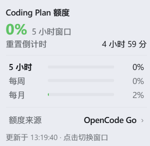
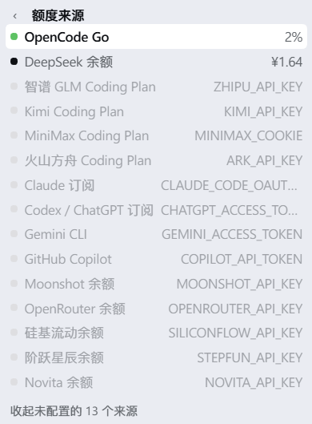

[](README.en.md) [](README.md)

# dsh-coding-plan-quota

A quota ring in the DSH composer tool row, immediately left of the model selector. It reads the usage
windows or account balances of your coding plans and shows **one source at a time**.

- **Click** the ring to cycle that source's windows: **5-hour → weekly → monthly**. A balance-only
  source refreshes instead.
- **Colour** by urgency: green `<50%` → blue `<75%` → orange `<90%` → red `≥90%`.
- **Hover** for the used percentage, a live reset countdown and a bar per window.
- The card names the current source in one `额度来源 · <name> ›` row. Click it to switch to another —
  the picker lists the sources that can actually answer, with a toggle for the rest.
- A source that fails keeps its last good numbers, marked `stale`, instead of going blank.

The chosen source and window persist in `localStorage`.

## Screenshots




## Install

From the DSH plugin market (category **Usage & Billing**), or:

```bash
dsh plugin --profile web add dsh-coding-plan-quota                  # npm
dsh plugin --profile web add github:sxwer001/dsh-coding-plan-quota  # GitHub
```

Restart DSH afterwards.

To work on the source instead of copying it:

```powershell
New-Item -ItemType Junction -Path "$env:USERPROFILE\.dsh\profiles\desktop\node_modules\dsh-coding-plan-quota" -Target "D:\Antigravityproject\dsh-coding-plan-quota"
```

## Sources

| Source | `id` | Credential | Notes |
| --- | --- | --- | --- |
| OpenCode Go | `opencode-go` | `OPENCODE_GO_API_KEY` | 5-hour / weekly / monthly |
| 智谱 GLM | `glm` | `ZHIPU_API_KEY` | 5-hour / weekly; `region: cn` uses `open.bigmodel.cn` |
| Kimi | `kimi` | `KIMI_API_KEY` | |
| MiniMax | `minimax` | `MINIMAX_COOKIE` | needs a browser session cookie, not an API key |
| 火山方舟 | `ark` | `ARK_API_KEY` | no public quota URL — set `endpoint` yourself |
| Claude 订阅 | `claude` | `CLAUDE_CODE_OAUTH_TOKEN` | OAuth token, not an API key |
| Codex / ChatGPT | `codex` | `CHATGPT_ACCESS_TOKEN` + `CHATGPT_ACCOUNT_ID` | `chatgpt.com` is unreachable from some networks |
| Gemini CLI | `gemini` | `GEMINI_ACCESS_TOKEN` | `cloudcode-pa.googleapis.com` is unreachable from some networks |
| GitHub Copilot | `copilot` | `COPILOT_API_TOKEN` | set `insecureTls: true` if a TLS proxy blocks the handshake |
| DeepSeek 余额 | `deepseek` | `DEEPSEEK_API_KEY` | balance only |
| Moonshot 余额 | `moonshot` | `MOONSHOT_API_KEY` | balance only |
| OpenRouter 余额 | `openrouter` | `OPENROUTER_API_KEY` | balance only |
| 硅基流动余额 | `siliconflow` | `SILICONFLOW_API_KEY` | balance only |
| 阶跃星辰余额 | `stepfun` | `STEPFUN_API_KEY` | balance only |
| Novita 余额 | `novita` | `NOVITA_API_KEY` | balance only |

A source without a credential just reports which one it needs. Percentages reported as `remaining` are
inverted into `used`; where a plan reports one window per model (GLM, Gemini), the worst model wins.

## Configuration

`apply(ctx, config)` merges the config over these defaults:

| Key | Default | Meaning |
| --- | --- | --- |
| `cacheMs` | `60000` | host-side cache lifetime per source |
| `timeoutMs` | `12000` | upstream request timeout |
| `thresholds` | `[50, 75, 90]` | green → blue → orange → red boundaries |
| `defaultProvider` | `"opencode-go"` | what to show before you pick one |
| `hideUnconfigured` | `false` | hide sources with no credential |
| `insecureTls` | `false` | skip certificate verification |
| `providers` | `{}` | per-source overrides, keyed by `id` |

Per-source overrides:

| Key | Meaning |
| --- | --- |
| `enabled` | `false` removes the source from the card |
| `endpoint` | replace the built-in URL (this is how you enable `ark`) |
| `apiKey` | a literal key, which beats every other credential source |
| `apiKeyEnv` | read the key from this environment variable instead |
| `region` | `"cn"` switches to the vendor's mainland endpoint |
| `insecureTls` | per-source override of the global flag |

```yaml
- insert:
    - id: coding-plan-quota
      name: dsh-coding-plan-quota
      config:
        thresholds: [50, 75, 90]
        defaultProvider: opencode-go
        providers:
          ark:
            endpoint: "https://<your-ark-quota-url>"
```

### Credentials

For each source, the first hit wins: `providers.<id>.apiKey` → the environment variable named by
`providers.<id>.apiKeyEnv` (or the built-in name) → DSH's `credentials` service →
`$DSH_HOME/.credentials.yaml` → the vendor's own CLI file, where one exists (OpenCode, Claude, Codex,
Gemini, Copilot).

Credentials are read on the node half and never sent to the browser.

## Notes

- The card follows the DSH UI language (zh / en) live, with no setting of its own.
- The browser half reads a same-origin route on the node half:
  `/plugins/dsh-coding-plan-quota/usage.json` (`?refresh=1`, `?provider=<id>`, `?debug=1`).
- Editing `lib/host.js` needs a DSH restart; editing `lib/client.js` only needs a page refresh.
- `node scripts/verify.mjs` runs the end-to-end checks.

## Layout

```
dsh-coding-plan-quota/
├── package.json          dsh.bundle.patch + dsh.client { platform: web }
├── cordis.patch.yml      - insert: [{ id, name }]
├── lib/
│   ├── host.js           node half — sources, credentials, cache, HTTP route
│   └── client.js         browser half — the ring, the card and the picker
├── scripts/
│   └── verify.mjs        end-to-end checks
├── README.md             Chinese (default)
└── README.en.md          English
```

## License

MIT
